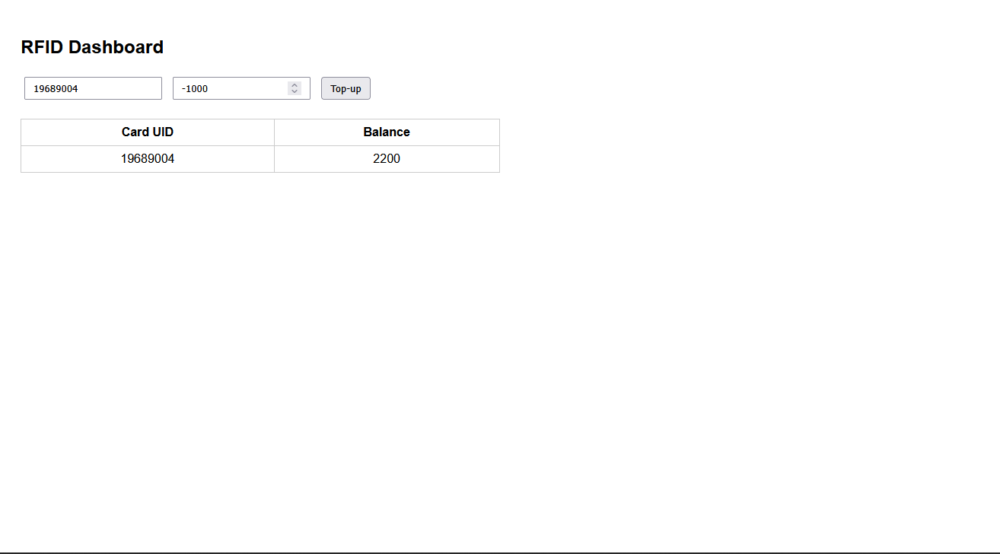

# RFID Card Top-Up System

This project implements a **real-time RFID card top-up system** using an ESP8266 microcontroller, a cloud backend, and a web dashboard. It allows users to top-up and monitor RFID card balances securely, using a **publish–subscribe architecture with MQTT** for device communication and **HTTP + WebSocket** for user interaction.

**Key Features:**

- ESP8266 reads and writes RFID card data.
- Real-time communication between ESP8266, backend, and web dashboard.
- Each team has isolated MQTT topics to avoid conflicts.
- Supports multiple top-ups and balance updates simultaneously.
- Cloud-hosted backend ensures users never interact directly with the hardware.

---

## System Architecture

```
[ESP8266] ---MQTT---> [Broker] ---MQTT---> [Backend VPS] ---WebSocket---> [Web Dashboard]
                     ^                                   ^
                     |                                   |
                     |                                   |
                 Top-up commands                     HTTP Top-up requests
```

**Components:**

1. **ESP8266 (Edge Controller):**
   - Reads RFID cards and publishes UID + balance.
   - Subscribes to top-up commands via MQTT.

2. **MQTT Broker:**
   - Message bus for devices and backend.
   - Ensures topic isolation per team (`rfid/<team_id>/...`).

3. **Backend API Service (Node.js):**
   - Receives HTTP top-up requests from dashboard.
   - Publishes top-up commands to ESP8266 via MQTT.
   - Broadcasts updated balances to dashboard via WebSocket.

4. **Web Dashboard:**
   - Allows users to input top-up amounts.
   - Displays real-time balances via WebSocket.

## Installation & Setup

### On ESP8266

1. Open `rfid.ino` in Arduino IDE.
2. Update Wi-Fi credentials and MQTT broker info:

```cpp
#define WIFI_SSID "Your_SSID"
#define WIFI_PASS "Your_Password"
#define MQTT_HOST "broker.benax.rw"
#define TEAM_ID "y2c_team0125"
```

3. Upload to ESP8266 board.

### On VPS / Backend

1. Clone the repository or copy the `web/` folder to your VPS:

```bash
scp -r web/ user@<VPS_IP>:~/rfid
```

2. Install dependencies:

```bash
cd ~/rfid/web
npm install
```

3. Start the backend:

```bash
node server.js
```

Optionally, use `nohup` to keep it running:

```bash
nohup node server.js > server.log 2>&1 &
```

4. Backend listens on port `9280` (this is default port for my setup) and communicates with ESP8266 via MQTT.

### Web Dashboard

- Access via `http://<VPS_IP>:9280`
- Input the **card UID** and **top-up amount**.
- Real-time balances are updated automatically.

## Usage

1. Place the RFID card near the ESP8266 reader.
2. Dashboard detects the card and shows current balance.
3. Input top-up amount → click **Top-Up** → backend sends command to ESP8266.
4. ESP8266 updates balance and publishes to MQTT → backend broadcasts via WebSocket → dashboard updates in real time.

## Preview



## Technology Stack

- **ESP8266** – RFID reading & MQTT client.
- **MFRC522** – RFID module.
- **MQTT Broker** – Message bus for ESP8266 ↔ Backend.
- **Node.js + Express** – Backend API service.
- **WebSocket** – Real-time dashboard updates.
- **HTML / CSS / JS** – Frontend dashboard.
